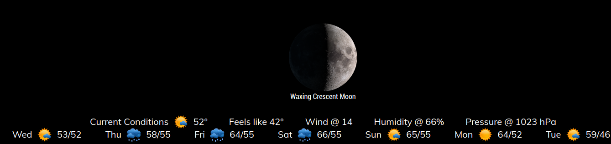
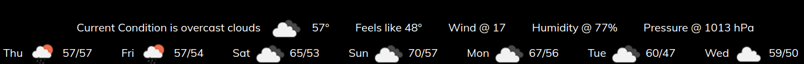

## MMM-BMW-OW

**Bugger My Weather**  Now using the free OpenWeather api

## Same church, different pew

* Due to Darksky discontinuing its free api I moved to OpenWeather
* The data is a bit different but you get 1000 calls a day!

## Good-bye bottom_bar (Well, not really)

* This was designed for use in the bottom_bar position of your MagicMirror
* Can share bottom bar position with any module via Hello_Lucy
* Minutely updates for current conditions
* CSS provided for coloring and sizing. Make it your own.

## Examples

* Default white



* Default white with OpenWeather icons



## Installation and requirements

* `git clone https://github.com/mykle1/MMM-BMW-OW` into the `~/MagicMirror/modules` directory.

* Free API key at `https://openweathermap.org/price` (Required)

* No dependencies needed! No kidding!

## Config.js entry and options

```
{
    disabled: false,
    module: "MMM-BMW-OW",
    position: "bottom_bar", // designed for bottom_bar(best) thirds should be good too
    config: {
        api: "Your FREE api key", // Get at https://openweathermap.org/price
        ownTitle: "Current Conditions",
        lat: '43.574794', // Your latitude
        lon: '-77.112454', // Your longitude
        css: "2", // 1-6
        playSounds: "no",
        useHeader: false, // true if you want a header
        header: "Your header",
        maxWidth: "100%",
        updateInterval: 5 * 60 * 1000,
    }
},
```

* MMM-BMW-DS still works if you have a Darksky api key (These will expire eventually)

* MMM-BMW-CC requires a free ClimaCell api key
